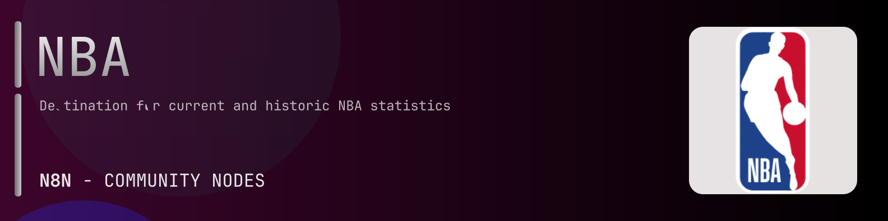

# @n8n-dev/n8n-nodes-nba



[](https://www.npmjs.com/package/@n8n-dev/n8n-nodes-nba)
[](https://opensource.org/licenses/MIT)

---

**Stop writing nba API integrations by hand.**

Every time you connect n8n to nba, you waste hours mapping endpoints, defining parameters, and debugging schemas. You copy-paste from docs, fix edge cases, and pray nothing breaks.

**What if connecting n8n to nba took 5 minutes, not half a day?**

This node gives you **1+ resources** out of the box: **Default**: with full CRUD operations, typed parameters, and zero manual configuration.

---

## What You Get

- **Zero boilerplate**: Resources, operations, and fields are pre-configured and ready to use
- **Full CRUD**: Create, read, update, and delete support where the API allows it
- **Typed parameters**: No more guessing field types
- **Built-in auth**: API key authentication, ready to go
- **Declarative**: Native n8n performance, no custom execute() overhead

---

## Install

```bash
npm install @n8n-dev/n8n-nodes-nba
```

**Or in n8n:**
1. **Settings → Community Nodes → Install**
2. Search: `@n8n-dev/n8n-nodes-nba`
3. Click **Install**

---

## Quick Start

1. Install the node (above)
2. Add credentials: **nba API** → paste your API key
3. Drag the **nba** node into your workflow
4. Pick a resource → pick an operation → done.

That's it. No configuration files. No code. It just works.

---

## Resources

<details>
<summary><b>Default</b> (83 operations)</summary>

- Get Allstarballotpredictor
- Get Boxscoreadvancedv 2
- Get Boxscorefourfactorsv 2
- Get Boxscoremiscv 2
- Get Boxscoreplayertrackv 2
- Get Boxscorescoringv 2
- Get Boxscoresummaryv 2
- Get Boxscoretraditionalv 2
- Get Boxscoreusagev 2
- Get Common Team Years
- Get Commonallplayers
- Get Commonplayerinfo
- Get Commonplayoffseries
- Get Commonteamroster
- Get Draftcombinedrillresults
- Get Draftcombinenonstationaryshooting
- Get Draftcombineplayeranthro
- Get Draftcombinespotshooting
- Get Draftcombinestats
- Get Drafthistory
- Get Franchisehistory
- Get Homepageleaders
- Get Homepagev 2
- Get Leaderstiles
- Get Leaguedashlineups
- Get Leaguedashplayerbiostats
- Get Leaguedashplayerclutch
- Get Leaguedashplayerptshot
- Get Leaguedashplayershotlocations
- Get Leaguedashplayerstats
- Get Leaguedashptdefend
- Get Leaguedashptteamdefend
- Get Leaguedashteamclutch
- Get Leaguedashteamptshot
- Get Leaguedashteamshotlocations
- Get Leaguedashteamstats
- Get Leagueleaders
- Get Playbyplay
- Get Playbyplayv 2
- Get Playercareerstats
- Get Playercompare
- Get Playerdashboardbyclutch
- Get Playerdashboardbygamesplits
- Get Playerdashboardbygeneralsplits
- Get Playerdashboardbylastngames
- Get Playerdashboardbyopponent
- Get Playerdashboardbyshootingsplits
- Get Playerdashboardbyteamperformance
- Get Playerdashboardbyyearoveryear
- Get Playerdashptpass
- Get Playerdashptreb
- Get Playerdashptshotdefend
- Get Playerdashptshots
- Get Playergamelog
- Get Playerprofile
- Get Playerprofilev 2
- Get Playersvsplayers
- Get Playervsplayer
- Get Playoffpicture
- Get Scoreboard
- Get Scoreboard v2
- Get Shotchartdetail
- Get Shotchartlineupdetail
- Get Teamdashboardbyclutch
- Get Teamdashboardbygamesplits
- Get Teamdashboardbygeneralsplits
- Get Teamdashboardbylastngames
- Get Teamdashboardbyopponent
- Get Teamdashboardbyshootingsplits
- Get Teamdashboardbyteamperformance
- Get Teamdashboardbyyearoveryear
- Get Teamdashlineups
- Get Teamdashptpass
- Get Teamdashptreb
- Get Teamdashptshots
- Get Teamgamelog
- Get Teaminfocommon
- Get Teamplayerdashboard
- Get Teamplayeronoffdetails
- Get Teamplayeronoffsummary
- Get Teamvsplayer
- Get Teamyearbyyearstats
- Get Video Status

</details>

---

## Why This Node?

**Without this node:**
- Hours of manual API integration
- Copy-pasting from nba docs
- Debugging auth, pagination, error handling
- Maintaining your own client code

**With this node:**
- Install → configure → use. 5 minutes.
- Auto-generated from the official nba OpenAPI spec
- Always up to date when the API changes
- Native n8n performance

---

## Auto-Generated
This node was auto-generated from the official **nba** OpenAPI specification using
[@n8n-dev/n8n-openapi-node-ultimate](https://github.com/kelvinzer0/n8n-openapi-node-ultimate),
then validated against the live API so you get accurate types and real parameters, not guesswork.

When the nba API updates, this node updates too.

---

## Support This Project

If this node saved you hours of work, consider supporting continued development, new APIs, better error handling, and faster updates.

[](https://n8n-code.github.io/membership/#/eyJ0aXRsZSI6IktlZXAgSXQgTW92aW5nIiwiZGVzYyI6Ik9uZSBkZXZlbG9wZXIgYnVpbHQgYSB0b29sIHRoYXQgYXV0by1nZW5lcmF0ZXNcbm44biBub2RlcyBmcm9tIGFueSBPcGVuQVBJIHNwZWMuXG5cbllvdXIgZG9uYXRpb24gZnVuZHMgbmV3IGZlYXR1cmVzLCBtb3JlIEFQSSBzdXBwb3J0LFxuYW5kIGJldHRlciB0b29saW5nIGZvciBldmVyeSBkZXZlbG9wZXIgYWZ0ZXIgeW91LiIsInRhcmdldCI6NTAwMCwiYWRkcmVzc2VzIjp7ImV0aGVyZXVtIjoiMHhmMDU1NWQ0MGRiRkI0ZTNCZjA3MDQ0MjgyQjc4RjJmRTFmNTFFZjcyIiwic29sYW5hIjoiNlpEVk5BYmpZZExEcXo4cGt3VUNHYllaNVV3QlFranB0QzU1Wk5vTFcybVUifSwiZGlzY29yZCI6Imh0dHBzOi8vZGlzY29yZC5nZy9wdERaOGU0aDkzIn0)

---

## License

MIT © [kelvinzer0](https://github.com/n8n-code)
